# Manual de Usuario — SGPA
**Sistema de Gestión de la Producción Agrícola**
Granja "El Guayabal" · UNAH

---

## Índice

1. [Introducción](#1-introducción)
2. [Acceso al sistema](#2-acceso-al-sistema)
3. [Panel principal (Dashboard)](#3-panel-principal-dashboard)
4. [Gestión de Áreas](#4-gestión-de-áreas)
5. [Gestión de Cultivos](#5-gestión-de-cultivos)
6. [Gestión de Tipos de Cultivo](#6-gestión-de-tipos-de-cultivo)
7. [Gestión de Área-Cultivo](#7-gestión-de-área-cultivo)
8. [Gestión de Producción](#8-gestión-de-producción)
9. [Gestión de Riego](#9-gestión-de-riego)
10. [Historial de Riego](#10-historial-de-riego)
11. [Gestión de Agroquímicos](#11-gestión-de-agroquímicos)
12. [Gestión de Usuarios](#12-gestión-de-usuarios)
13. [Rendimiento](#13-rendimiento)
14. [Reportes](#14-reportes)

---

## 1. Introducción

El **SGPA** (Sistema de Gestión de la Producción Agrícola) es una aplicación web desarrollada para la granja "El Guayabal" que permite administrar de forma centralizada las áreas de cultivo, la producción, el riego, el uso de agroquímicos y la generación de reportes.

### Objetivos del sistema

- Centralizar el registro y seguimiento de las actividades agrícolas de la granja.
- Facilitar el control del inventario de agroquímicos y los planes de riego.
- Generar reportes analíticos en formato PDF para la toma de decisiones.
- Controlar el acceso por roles: administrador, director y trabajador.

### Roles del sistema

| Rol | Permisos principales |
|-----|----------------------|
| **Administrador** | Gestión de usuarios del sistema |
| **Director** | Acceso completo a funciones, análisis y reportes |
| **Trabajador** | Registro de producción, riego y agroquímicos |
| **Técnico** | Consulta de análisis y reportes |

---

## 2. Acceso al sistema

Para ingresar al sistema, el usuario debe abrir el navegador web y acceder a la URL del servidor donde esté desplegado el SGPA.

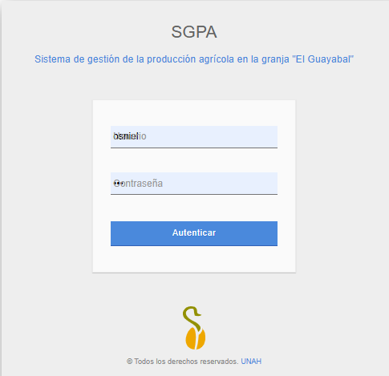

**Pasos para autenticarse:**

1. Ingresar el **Usuario** en el primer campo de texto.
2. Ingresar la **Contraseña** en el segundo campo.
3. Presionar el botón **Autenticar**.

> **Nota:** Si las credenciales son incorrectas, el sistema mostrará un mensaje de error. Contacte al administrador del sistema si no recuerda sus datos de acceso.

---

## 3. Panel principal (Dashboard)

Una vez autenticado correctamente, el sistema redirige al **panel principal (INICIO)**, donde se presenta la identidad de la granja y los accesos rápidos a las funciones más usadas.

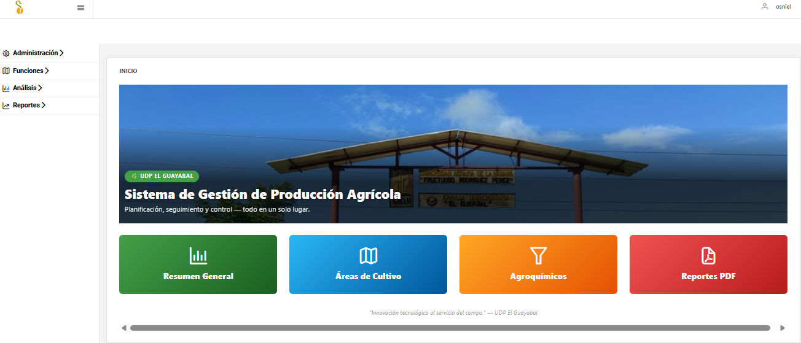

### Menú lateral

El menú de navegación se encuentra en el panel izquierdo y está organizado en cuatro secciones expandibles:

| Sección | Contenido |
|---------|-----------|
| **Administración** | Gestión de usuarios del sistema |
| **Funciones** | Áreas, tipos de cultivo, agroquímicos, cultivos, producción, espacial y riego |
| **Análisis** | Resumen general, rendimiento e historial de riegos |
| **Reportes** | Generación de reportes en PDF |

### Accesos rápidos

El panel central muestra cuatro botones de acceso directo:

| Botón | Destino |
|-------|---------|
| Resumen General | Vista consolidada de la producción |
| Áreas de Cultivo | Gestión de áreas |
| Agroquímicos | Gestión de agroquímicos |
| Reportes PDF | Módulo de reportes |

---

## 4. Gestión de Áreas

Esta sección permite administrar las áreas físicas de la granja (parcelas, lotes, sectores, etc.).

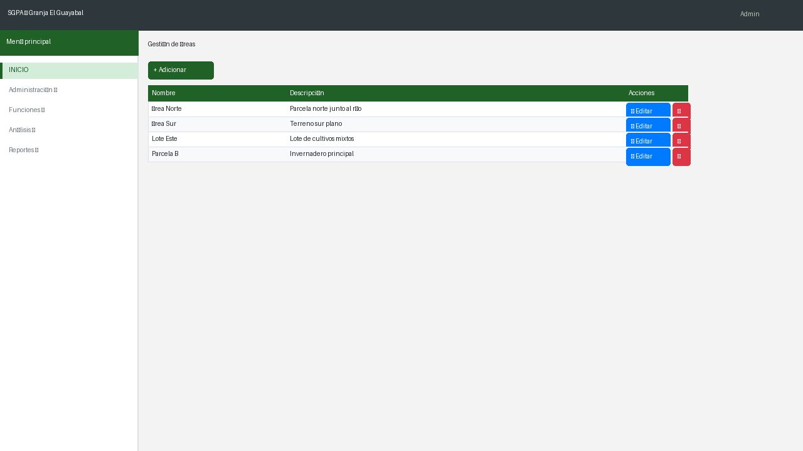

### Campos del formulario

| Campo | Descripción |
|-------|-------------|
| **Nombre** | Nombre identificador del área (ej. "Parcela Norte") |
| **Descripción** | Información adicional sobre la ubicación o características del área |

### Acciones disponibles

| Acción | Descripción |
|--------|-------------|
| **+ Adicionar** | Abre el formulario para registrar una nueva área |
| **Editar** (ícono azul) | Permite modificar los datos del área seleccionada |
| **Eliminar** (ícono rojo) | Elimina permanentemente el área del sistema |

> **Advertencia:** Eliminar un área puede afectar los registros de cultivos y producción asociados a ella.

---

## 5. Gestión de Cultivos

Permite registrar y administrar los cultivos disponibles en la granja.

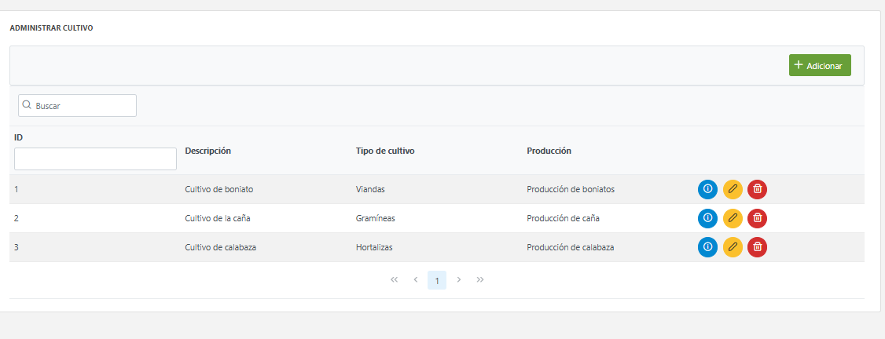

### Campos del formulario

| Campo | Descripción |
|-------|-------------|
| **Nombre** | Nombre del cultivo (ej. "Maíz", "Frijol") |
| **Tipo de Cultivo** | Clasificación del cultivo (selección de lista) |
| **Fecha de Siembra** | Fecha en que se realizó o planificó la siembra |
| **Fecha de Recogida** | Fecha estimada o real de la cosecha |

### Acciones disponibles

| Acción | Descripción |
|--------|-------------|
| **+ Adicionar** | Registra un nuevo cultivo |
| **Editar** | Modifica los datos de un cultivo existente |
| **Eliminar** | Elimina un cultivo del sistema |

---

## 6. Gestión de Tipos de Cultivo

Permite clasificar los cultivos por tipo para facilitar su categorización y análisis.

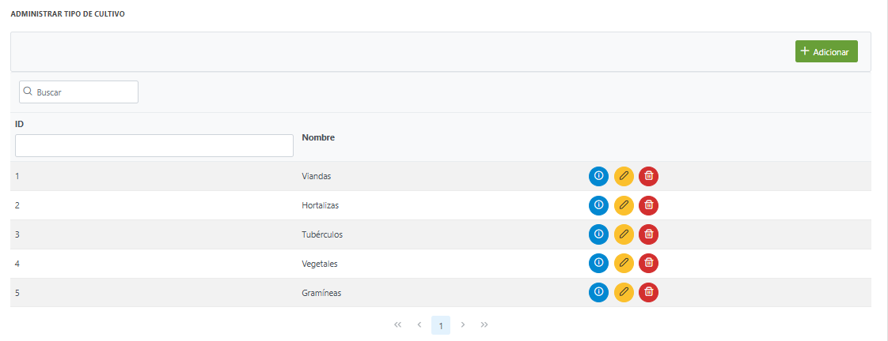

### Campos del formulario

| Campo | Descripción |
|-------|-------------|
| **Nombre** | Nombre del tipo (ej. "Permanente", "Temporal", "Hortícola") |

### Acciones disponibles

| Acción | Descripción |
|--------|-------------|
| **+ Adicionar** | Crea una nueva categoría de cultivo |
| **Editar** | Modifica el nombre del tipo de cultivo |
| **Eliminar** | Elimina el tipo del sistema |

---

## 7. Gestión de Área-Cultivo

Asocia un cultivo a un área específica de la granja, estableciendo qué cultivo se trabaja en cada zona y en qué período.

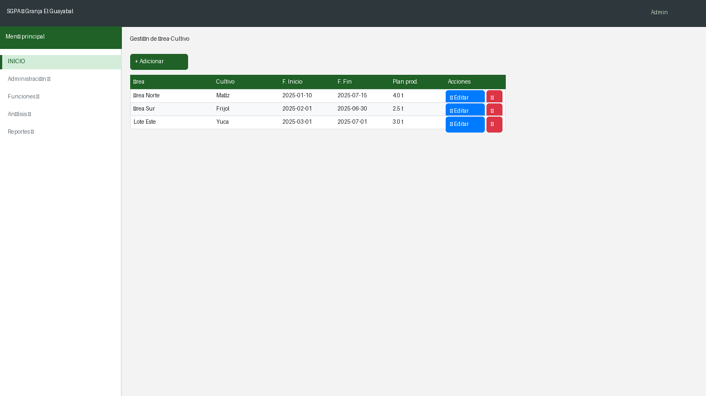

### Campos del formulario

| Campo | Descripción |
|-------|-------------|
| **Área** | Selección del área de la granja |
| **Cultivo** | Selección del cultivo a asociar |
| **Fecha de inicio** | Fecha de inicio de la asociación |
| **Fecha de fin** | Fecha estimada de finalización |

### Acciones disponibles

| Acción | Descripción |
|--------|-------------|
| **+ Adicionar** | Crea una nueva asociación área-cultivo |
| **Editar** | Modifica la asociación existente |
| **Eliminar** | Elimina la asociación |

> **Nota:** Un área puede tener múltiples cultivos en distintos períodos de tiempo.

---

## 8. Gestión de Producción

Registra los datos de producción obtenidos en cada área de cultivo: cantidades cosechadas, unidades y observaciones.

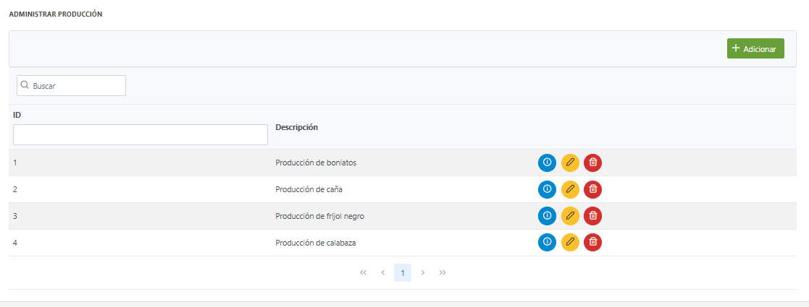

### Campos del formulario

| Campo | Descripción |
|-------|-------------|
| **Área-Cultivo** | Selección de la asociación área-cultivo |
| **Cantidad** | Volumen o peso de la producción obtenida |
| **Unidad de medida** | Ej. kg, toneladas, quintales |
| **Fecha** | Fecha en que se registra la producción |
| **Observaciones** | Notas adicionales sobre la cosecha |

### Acciones disponibles

| Acción | Descripción |
|--------|-------------|
| **+ Adicionar** | Registra un nuevo dato de producción |
| **Editar** | Modifica un registro existente |
| **Eliminar** | Elimina el registro de producción |

---

## 9. Gestión de Riego

Permite programar y registrar los ciclos de riego aplicados a los cultivos de la granja.

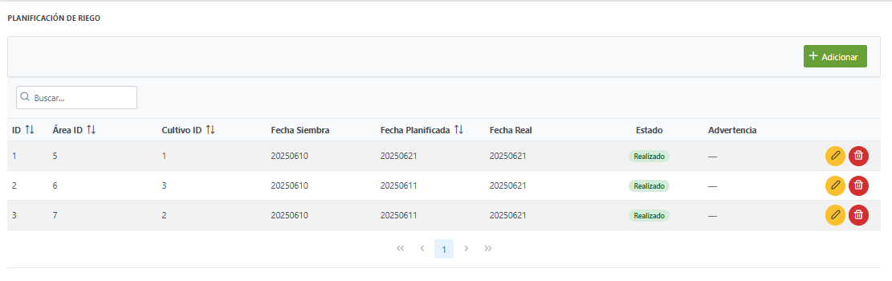

### Campos del formulario

| Campo | Descripción |
|-------|-------------|
| **Área-Cultivo** | Área y cultivo al que se aplica el riego |
| **Tipo de riego** | Método utilizado (ej. goteo, aspersión, superficie) |
| **Duración** | Tiempo de aplicación del riego |
| **Fecha** | Fecha programada o realizada del riego |
| **Observaciones** | Comentarios adicionales |

### Acciones disponibles

| Acción | Descripción |
|--------|-------------|
| **+ Adicionar** | Crea un nuevo registro de riego |
| **Editar** | Modifica el registro de riego |
| **Eliminar** | Elimina el registro |

---

## 10. Historial de Riego

Muestra el historial completo de riegos realizados, permitiendo filtrar por criterios específicos para su análisis y seguimiento.

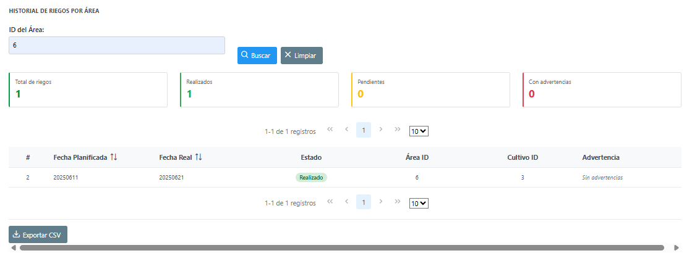

### Filtros disponibles

| Filtro | Descripción |
|--------|-------------|
| **Área** | Filtra los registros por área de la granja |
| **Fecha desde / hasta** | Rango de fechas del historial |

### Información mostrada

La tabla de resultados presenta:
- Área y cultivo asociado
- Tipo y duración del riego
- Fecha de ejecución
- Observaciones registradas

> **Consejo:** Use los filtros de fecha para generar resúmenes mensuales del riego aplicado por área.

---

## 11. Gestión de Agroquímicos

Administra el inventario y la aplicación de agroquímicos (fertilizantes, pesticidas, herbicidas, etc.) en los cultivos de la granja.

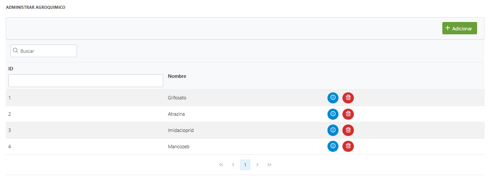

### Campos del formulario

| Campo | Descripción |
|-------|-------------|
| **Nombre** | Nombre comercial o genérico del agroquímico |
| **Tipo** | Categoría: fertilizante, pesticida, herbicida, fungicida, etc. |
| **Unidad** | Unidad de medida (litros, kg, gramos) |
| **Stock** | Cantidad disponible en inventario |

### Acciones disponibles

| Acción | Descripción |
|--------|-------------|
| **+ Adicionar** | Registra un nuevo agroquímico en el inventario |
| **Editar** | Modifica los datos del agroquímico |
| **Eliminar** | Elimina el agroquímico del sistema |

> **Advertencia:** Verifique el stock disponible antes de programar aplicaciones de agroquímicos.

---

## 12. Gestión de Usuarios

Módulo exclusivo para administradores. Permite crear, editar y eliminar los usuarios del sistema, así como asignar roles y permisos.

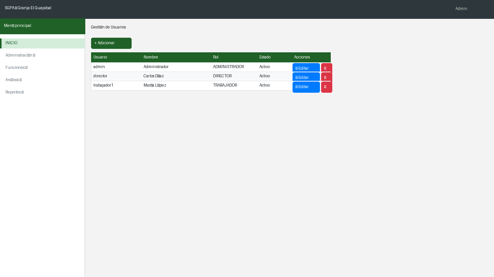

### Campos del formulario

| Campo | Descripción |
|-------|-------------|
| **Nombre de usuario** | Identificador único para el acceso al sistema |
| **Contraseña** | Clave de acceso del usuario |
| **Rol** | Administrador, Director, Trabajador o Técnico |
| **Estado** | Activo / Inactivo |

### Acciones disponibles

| Acción | Descripción |
|--------|-------------|
| **+ Adicionar** | Crea una nueva cuenta de usuario |
| **Editar** | Modifica los datos o el rol del usuario |
| **Eliminar** | Desactiva o elimina la cuenta del usuario |

> **Importante:** Solo los usuarios con rol **Administrador** tienen acceso a este módulo. Asigne los roles con cuidado, ya que determinan las funciones visibles para cada usuario.

---

## 13. Rendimiento

Muestra indicadores del rendimiento productivo por cultivo y por área, permitiendo comparar resultados entre períodos.

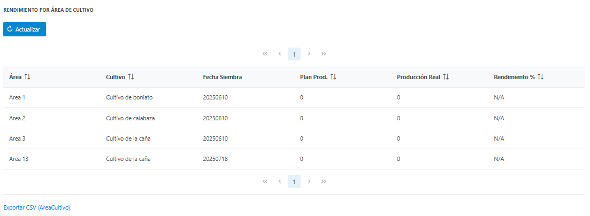

### Métricas mostradas

| Indicador | Descripción |
|-----------|-------------|
| **Producción total** | Cantidad total cosechada por área o cultivo |
| **Rendimiento por área** | Producción en relación al tamaño del área |
| **Comparativo por período** | Evolución de la producción en el tiempo |

### Uso recomendado

1. Seleccione el período de análisis (mes, trimestre, año).
2. Filtre por área o tipo de cultivo según el análisis requerido.
3. Compare los resultados para identificar áreas de mejora.

---

## 14. Reportes

El sistema genera reportes en formato PDF para el análisis y documentación de las actividades de la granja.

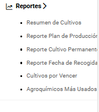

### Tipos de reportes disponibles

| Reporte | Descripción |
|---------|-------------|
| **Resumen de Cultivos** | Estado general de todos los cultivos registrados |
| **Plan de Producción** | Proyección y seguimiento del plan productivo |
| **Cultivo Permanente** | Listado de cultivos de carácter permanente |
| **Fecha de Recogida** | Cultivos ordenados por fecha de cosecha |
| **Cultivos por Vencer** | Cultivos próximos a su fecha límite |
| **Agroquímicos Más Usados** | Ranking de uso de agroquímicos por período |

### Cómo generar un reporte

1. Seleccione el tipo de reporte desde el menú **Reportes**.
2. Configure los filtros de búsqueda (fechas, área, cultivo).
3. Presione el botón **Generar** o **Descargar PDF**.
4. El sistema generará el reporte y lo descargará automáticamente en su navegador.

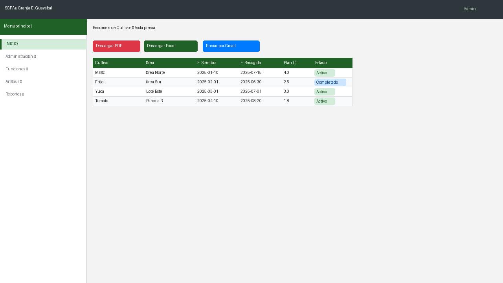

> **Nota:** Los reportes se generan en formato PDF y pueden abrirse con cualquier visor de documentos estándar (Adobe Reader, navegador web, etc.).

---

*© 2025 Todos los derechos reservados. Universidad Agraria de La Habana (UNAH)*
