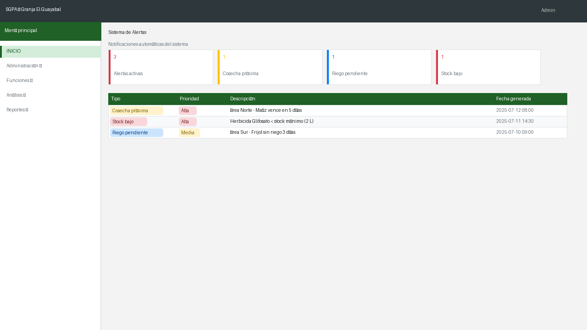
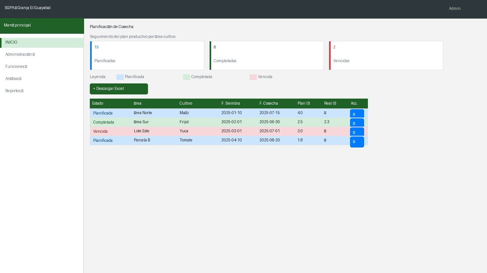
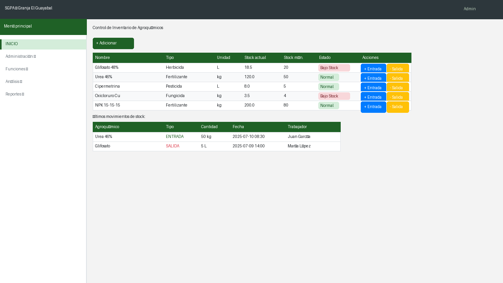

# Manual de Usuario — SGPA
**Sistema de Gestión de la Producción Agrícola**
Granja "El Guayabal" · UNAH

---

## Índice

1. [Introducción](#1-introducción)
2. [Acceso al sistema](#2-acceso-al-sistema)
3. [Panel principal (Dashboard)](#3-panel-principal-dashboard)
4. [Sistema de Alertas](#4-sistema-de-alertas)
5. [Gestión de Áreas](#5-gestión-de-áreas)
6. [Gestión de Cultivos](#6-gestión-de-cultivos)
7. [Gestión de Tipos de Cultivo](#7-gestión-de-tipos-de-cultivo)
8. [Gestión de Área-Cultivo](#8-gestión-de-área-cultivo)
9. [Planificación de Cosecha](#9-planificación-de-cosecha)
10. [Gestión de Producción](#10-gestión-de-producción)
11. [Gestión de Riego](#11-gestión-de-riego)
12. [Historial de Riego](#12-historial-de-riego)
13. [Control de Inventario de Agroquímicos](#13-control-de-inventario-de-agroquímicos)
14. [Gestión de Usuarios](#14-gestión-de-usuarios)
15. [Panel de Rendimiento](#15-panel-de-rendimiento)
16. [Reportes](#16-reportes)

---

## 1. Introducción

El **SGPA** (Sistema de Gestión de la Producción Agrícola) es una aplicación web desarrollada para la granja "El Guayabal" que permite administrar de forma centralizada las áreas de cultivo, la producción, el riego, el uso de agroquímicos y la generación de reportes.

### Objetivos del sistema

- Centralizar el registro y seguimiento de las actividades agrícolas de la granja.
- Facilitar el control del inventario de agroquímicos con alertas automáticas de stock bajo.
- Planificar y registrar cosechas con seguimiento de producción real vs. planificada.
- Generar reportes analíticos en formatos PDF y Excel para la toma de decisiones.
- Controlar el acceso por roles: administrador, director y trabajador.

### Roles del sistema

| Rol | Permisos principales |
|-----|----------------------|
| **Administrador** | Gestión de usuarios del sistema |
| **Director** | Acceso completo a funciones, análisis y reportes |
| **Trabajador** | Registro de producción, riego y agroquímicos |
| **Técnico** | Consulta de análisis y reportes |

---

## 2. Acceso al sistema

Para ingresar al sistema, se debe abrir el navegador web y acceder a la URL del servidor donde esté desplegado el SGPA.

**Pasos para autenticarse:**

1. Ingresar el **Usuario** en el primer campo de texto.
2. Ingresar la **Contraseña** en el segundo campo.
3. Presionar el botón **Autenticar**.

> **Nota:** Si las credenciales son incorrectas, el sistema mostrará un mensaje de error. Contacte al administrador del sistema si no recuerda sus datos de acceso.

---

## 3. Panel principal (Dashboard)

Una vez autenticado, el sistema redirige al **panel principal**, donde se presentan los indicadores clave del estado de la granja en tiempo real.

### Tarjetas KPI

El panel muestra cinco tarjetas de indicadores actualizados automáticamente:

| Indicador | Descripción |
|-----------|-------------|
| **Total Áreas** | Número de áreas de cultivo registradas |
| **Cultivos activos** | Cultivos con área-cultivo activa en el período |
| **Riegos este mes** | Riegos ejecutados en el mes actual |
| **Alertas pendientes** | Notificaciones del sistema sin resolver |
| **Producción del período** | Producción total acumulada en el período actual |

### Gráficos analíticos

El panel incluye tres gráficos interactivos:

| Gráfico | Tipo | Descripción |
|---------|------|-------------|
| **Producción planificada vs. real** | Barras agrupadas | Comparativa por cultivo para el período actual |
| **Distribución de cultivos** | Dona | Proporción de cada cultivo sobre el total de áreas activas |
| **Estado de riegos** | Barras horizontales | Riegos ejecutados, pendientes y vencidos |

### Menú lateral

El menú de navegación se encuentra en el panel izquierdo, organizado en cuatro secciones expandibles:

| Sección | Módulos incluidos |
|---------|-----------|
| **Administración** | Gestión de usuarios |
| **Funciones** | Áreas, Tipos de Cultivo, Agroquímicos, Cultivos, Producción, Área de Cultivo, Riego, Planificación de Cosecha |
| **Análisis** | Dashboard, Sistema de Alertas, Panel de Rendimiento, Historial de Riegos |
| **Reportes** | Generación de reportes en PDF y Excel |

---

## 4. Sistema de Alertas

El módulo de alertas genera notificaciones automáticas para eventos críticos de la granja, sin necesidad de revisión manual.

### Tipos de alertas

| Tipo | Condición que la genera | Prioridad |
|------|-------------------------|-----------|
| **Cosecha próxima** | Fecha de cosecha de un área-cultivo ≤ 7 días | Alta |
| **Riego pendiente** | Riego planificado sin ejecutar en los próximos días | Media |
| **Stock bajo** | Stock actual de un agroquímico ≤ stock mínimo configurado | Alta |

### Información mostrada en la tabla

| Columna | Descripción |
|---------|-------------|
| **Tipo** | Categoría de la alerta con badge de color |
| **Prioridad** | Rojo (Alta), Amarillo (Media), Azul (Baja) |
| **Descripción** | Detalle de la situación: área, cultivo o agroquímico afectado |
| **Fecha generada** | Fecha y hora en que el sistema detectó la condición |

> **Consejo:** Revise las alertas diariamente al inicio de la jornada para atender las situaciones críticas con anticipación.

---

## 5. Gestión de Áreas

Esta sección permite administrar las áreas físicas de la granja (parcelas, lotes, sectores, etc.).

### Campos del formulario

| Campo | Descripción |
|-------|-------------|
| **Nombre** | Nombre identificador del área (ej. "Parcela Norte") |
| **Descripción** | Información adicional sobre la ubicación o características del área |

### Acciones disponibles

| Acción | Descripción |
|--------|-------------|
| **+ Adicionar** | Abre el formulario para registrar una nueva área |
| **Editar** (ícono azul) | Permite modificar los datos del área seleccionada |
| **Eliminar** (ícono rojo) | Elimina permanentemente el área del sistema |

> **Advertencia:** Eliminar un área puede afectar los registros de cultivos y producción asociados a ella.

---

## 6. Gestión de Cultivos

Permite registrar y administrar los cultivos disponibles en la granja.

### Campos del formulario

| Campo | Descripción |
|-------|-------------|
| **Nombre** | Nombre del cultivo (ej. "Maíz", "Frijol") |
| **Tipo de Cultivo** | Clasificación del cultivo (selección de lista) |
| **Fecha de Siembra** | Fecha en que se realizó o planificó la siembra |
| **Fecha de Recogida** | Fecha estimada o real de la cosecha |

### Acciones disponibles

| Acción | Descripción |
|--------|-------------|
| **+ Adicionar** | Registra un nuevo cultivo |
| **Editar** | Modifica los datos de un cultivo existente |
| **Eliminar** | Elimina un cultivo del sistema |

---

## 7. Gestión de Tipos de Cultivo

Permite clasificar los cultivos por tipo para facilitar su categorización y análisis.

### Campos del formulario

| Campo | Descripción |
|-------|-------------|
| **Nombre** | Nombre del tipo (ej. "Permanente", "Temporal", "Hortícola") |

### Acciones disponibles

| Acción | Descripción |
|--------|-------------|
| **+ Adicionar** | Crea una nueva categoría de cultivo |
| **Editar** | Modifica el nombre del tipo de cultivo |
| **Eliminar** | Elimina el tipo del sistema |

---

## 8. Gestión de Área-Cultivo

Asocia un cultivo a un área específica de la granja, estableciendo qué cultivo se trabaja en cada zona y en qué período.

### Campos del formulario

| Campo | Descripción |
|-------|-------------|
| **Área** | Selección del área de la granja |
| **Cultivo** | Selección del cultivo a asociar |
| **Fecha de inicio** | Fecha de inicio de la asociación |
| **Fecha de fin** | Fecha estimada de finalización |
| **Producción planificada** | Cantidad esperada de producción en la unidad del cultivo |

### Acciones disponibles

| Acción | Descripción |
|--------|-------------|
| **+ Adicionar** | Crea una nueva asociación área-cultivo |
| **Editar** | Modifica la asociación existente |
| **Registrar producción real** | Abre un diálogo para ingresar la producción obtenida |
| **Eliminar** | Elimina la asociación |

> **Nota:** Un área puede tener múltiples cultivos en distintos períodos de tiempo.

---

## 9. Planificación de Cosecha

Muestra todas las áreas-cultivo activas en formato de tabla con código de colores según el estado de la cosecha, permitiendo un seguimiento visual del plan productivo.

### Indicadores KPI

En la parte superior se muestran tres contadores:

| Indicador | Descripción |
|-----------|-------------|
| **Planificadas** | Total de cosechas con fecha futura aún pendientes |
| **Completadas** | Cosechas con producción real registrada |
| **Vencidas** | Cosechas cuya fecha de recogida ya pasó sin producción registrada |

### Código de colores de la tabla

| Color de fila | Estado | Significado |
|---------------|--------|-------------|
| Azul claro | **Planificada** | La fecha de cosecha es futura |
| Verde claro | **Completada** | Se registró la producción real |
| Rojo claro | **Vencida** | La fecha de cosecha pasó sin registro |

### Cómo registrar la producción real

1. Localice la fila del área-cultivo deseada en la tabla.
2. Haga clic en el ícono de lápiz (✏) en la columna de acciones.
3. En el diálogo emergente ingrese la cantidad de producción real obtenida.
4. Presione **Guardar** — la fila cambiará automáticamente a verde.

### Exportar a Excel

Haga clic en **Descargar Excel** para obtener la tabla completa en formato `.xlsx`, con todos los estados y datos de producción planificada vs. real.

---

## 10. Gestión de Producción

Registra los datos de producción obtenidos en cada área de cultivo: cantidades cosechadas, unidades y observaciones.

### Campos del formulario

| Campo | Descripción |
|-------|-------------|
| **Área-Cultivo** | Selección de la asociación área-cultivo |
| **Cantidad** | Volumen o peso de la producción obtenida |
| **Unidad de medida** | Ej. kg, toneladas, quintales |
| **Fecha** | Fecha en que se registra la producción |
| **Observaciones** | Notas adicionales sobre la cosecha |

### Acciones disponibles

| Acción | Descripción |
|--------|-------------|
| **+ Adicionar** | Registra un nuevo dato de producción |
| **Editar** | Modifica un registro existente |
| **Eliminar** | Elimina el registro de producción |

---

## 11. Gestión de Riego

Permite programar y registrar los ciclos de riego aplicados a los cultivos de la granja.

### Campos del formulario

| Campo | Descripción |
|-------|-------------|
| **Área-Cultivo** | Área y cultivo al que se aplica el riego |
| **Tipo de riego** | Método utilizado (ej. goteo, aspersión, superficie) |
| **Duración** | Tiempo de aplicación del riego |
| **Fecha** | Fecha programada o realizada del riego |
| **Observaciones** | Comentarios adicionales |

### Acciones disponibles

| Acción | Descripción |
|--------|-------------|
| **+ Adicionar** | Crea un nuevo registro de riego |
| **Editar** | Modifica el registro de riego |
| **Eliminar** | Elimina el registro |

---

## 12. Historial de Riego

Muestra el historial completo de riegos realizados con indicadores de resumen, herramientas de búsqueda y exportación.

### Tarjetas de resumen

En la parte superior se presentan cuatro indicadores:

| Indicador | Descripción |
|-----------|-------------|
| **Total riegos** | Número total de registros en el período consultado |
| **Riegos este mes** | Riegos ejecutados en el mes en curso |
| **Área más regada** | El área con mayor cantidad de ciclos de riego |
| **Duración promedio** | Tiempo promedio por ciclo de riego |

### Búsqueda y filtros

| Filtro | Descripción |
|--------|-------------|
| **Área** | Filtra los registros por área de la granja |
| **Tipo de riego** | Filtra por método de riego aplicado |
| **Fecha desde / hasta** | Rango de fechas del historial |

### Información de la tabla

La tabla de resultados presenta:
- Área y cultivo asociado
- Tipo de riego con badge de color por método (goteo, aspersión, superficie)
- Duración del ciclo
- Fecha de ejecución
- Observaciones registradas

### Exportar a CSV

Haga clic en el botón **Exportar CSV** para descargar el historial filtrado en formato `.csv`, compatible con Excel y otras hojas de cálculo.

> **Consejo:** Use los filtros de fecha para generar resúmenes mensuales del riego aplicado por área.

---

## 13. Control de Inventario de Agroquímicos

Administra el inventario de agroquímicos (fertilizantes, pesticidas, herbicidas, etc.) con control de stock y registro de movimientos de entrada y salida.

### Campos del formulario

| Campo | Descripción |
|-------|-------------|
| **Nombre** | Nombre comercial o genérico del agroquímico |
| **Tipo** | Categoría: fertilizante, pesticida, herbicida, fungicida, etc. |
| **Unidad** | Unidad de medida (litros, kg, gramos) |
| **Stock Actual** | Cantidad disponible en inventario en este momento |
| **Stock Mínimo** | Umbral bajo el cual el sistema genera una alerta automática |
| **Estado** | Badge automático: **Normal** (verde) o **Bajo Stock** (rojo) |

### Acciones disponibles

| Acción | Descripción |
|--------|-------------|
| **+ Adicionar** | Registra un nuevo agroquímico en el inventario |
| **Editar** | Modifica los datos del agroquímico |
| **+ Entrada** | Registra el ingreso de unidades al inventario |
| **- Salida** | Registra el consumo o retiro de unidades del inventario |
| **Eliminar** | Elimina el agroquímico del sistema |

### Movimientos de inventario

Cada entrada o salida de stock queda registrada con:
- Tipo de movimiento (ENTRADA / SALIDA)
- Cantidad
- Fecha y hora del movimiento
- Trabajador responsable
- Observaciones

El stock actual se actualiza automáticamente tras cada movimiento. Si el stock resultante cae al nivel mínimo o por debajo, el sistema genera automáticamente una alerta en el módulo de Alertas.

> **Advertencia:** No es posible registrar una salida de stock si la cantidad solicitada es mayor que el stock actual disponible.

---

## 14. Gestión de Usuarios

Módulo exclusivo para administradores. Permite crear, editar y eliminar los usuarios del sistema, así como asignar roles y permisos.

### Campos del formulario

| Campo | Descripción |
|-------|-------------|
| **Nombre de usuario** | Identificador único para el acceso al sistema |
| **Contraseña** | Clave de acceso del usuario |
| **Rol** | Administrador, Director, Trabajador o Técnico |
| **Estado** | Activo / Inactivo |

### Acciones disponibles

| Acción | Descripción |
|--------|-------------|
| **+ Adicionar** | Crea una nueva cuenta de usuario |
| **Editar** | Modifica los datos o el rol del usuario |
| **Eliminar** | Desactiva o elimina la cuenta del usuario |

> **Importante:** Solo los usuarios con rol **Administrador** tienen acceso a este módulo. Asigne los roles con cuidado, ya que determinan las funciones visibles para cada usuario.

---

## 15. Panel de Rendimiento

Presenta indicadores de rendimiento productivo por cultivo y área, comparando la producción planificada contra la producción real obtenida.

### Tabla comparativa

La tabla principal muestra para cada área-cultivo:

| Columna | Descripción |
|---------|-------------|
| **Área** | Nombre del área de la granja |
| **Cultivo** | Nombre del cultivo |
| **Planificado (t)** | Cantidad prevista al inicio del ciclo |
| **Real (t)** | Cantidad efectivamente cosechada |
| **Diferencia** | Variación entre lo planificado y lo real (verde si positiva, rojo si negativa) |
| **Cumplimiento (%)** | Porcentaje del plan productivo alcanzado |

### Cómo interpretar los resultados

- **Diferencia en verde**: la producción superó lo planificado.
- **Diferencia en rojo**: la producción estuvo por debajo del plan.
- Un cumplimiento inferior al 80 % puede indicar problemas en la zona que requieren atención.

### Exportar a CSV

Haga clic en **Exportar CSV** para descargar la tabla de rendimiento en formato `.csv` y realizar análisis adicionales en Excel u otra hoja de cálculo.

---

## 16. Reportes

El sistema genera reportes en formatos PDF y Excel para el análisis y documentación de las actividades de la granja.

### Tipos de reportes disponibles

| Reporte | Descripción |
|---------|-------------|
| **Resumen de Cultivos** | Estado general de todos los cultivos registrados |
| **Plan de Producción** | Proyección y seguimiento del plan productivo |
| **Cultivo Permanente** | Listado de cultivos de carácter permanente |
| **Fecha de Recogida** | Cultivos ordenados por fecha de cosecha |
| **Cultivos por Vencer** | Cultivos próximos a su fecha límite |
| **Agroquímicos Más Usados** | Ranking de uso de agroquímicos por período |

### Cómo generar un reporte

1. Seleccione el tipo de reporte desde el menú **Reportes**.
2. Configure los filtros de búsqueda (fechas, área, cultivo).
3. El sistema muestra una **vista previa** en pantalla con los datos del reporte.
4. Seleccione la acción deseada:

| Acción | Descripción |
|--------|-------------|
| **Descargar PDF** | Genera y descarga el reporte en formato PDF |
| **Descargar Excel** | Genera y descarga el reporte en formato `.xlsx` |
| **Enviar por Gmail** | Descarga el Excel y abre Gmail con el asunto pre-rellenado |

### Botón "Enviar por Gmail"

Al hacer clic en **Enviar por Gmail**:
1. El sistema descarga el archivo Excel automáticamente en su navegador.
2. Se abre Gmail en una nueva pestaña con el asunto del reporte ya escrito.
3. Solo debe adjuntar el archivo descargado al correo y enviarlo.

> **Nota:** Los reportes PDF pueden abrirse con cualquier visor de documentos estándar (Adobe Reader, navegador web, etc.). Los reportes Excel son compatibles con Microsoft Excel, LibreOffice Calc y Google Sheets.

---

*© 2025 Todos los derechos reservados. Universidad Agraria de La Habana (UNAH)*
